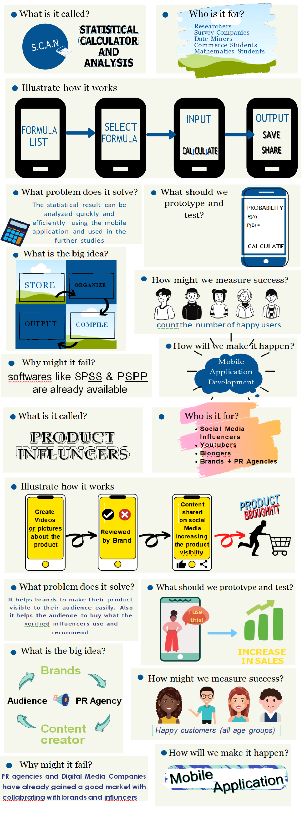

# S.C.A.N.
Source code for Statistical Calculator for ANalysis (S.C.A.N.)

  
  

      God has created the ever-flowing river of Time and omnipresent gust of Truth. 
      Torn by Desire, Man scours the world for an answer. 
      What is right, and which is the path of Truth? Only Time will tell.
  

  <a href='https://www.youtube.com/watch?v=BIx0HM_9wcU'>Trailer</a>
  
  
  
  <h1> Gallery </h1>
  

      The landing scene of the application. A list of mathematical formulas and modules are grouped. The user can use the search bar or scroll vertically to find the module of         their choice.
  

  
  
  

      Upon selecting a module, a list of formulas that come under that module are shown. The user can then select the particular formula that they want to use.
  

  
  
  

      Upon selecting a formula, an input screen opens. It is customised according to whether the formula excepts a list of values, a set of fixed variables, etc. The user needs       to enter the formula input values here.
  

  
  
  

      Upon entering the inputs, the formula will process them and the output is shown. The format of the output may be a line-chart, a pie-chart, a bar-chart, or simply the           numerical answer.
  

  
  
  

      Here, the user can perform their analytics and make proper suppositions.
         
      For uninformed users, there are descriptions of how to read the output.
  

  
  
  
  <h1> Prerequisites </h1>
  <a href='https://developer.android.com/studio'> Android Studio </a>
  
  
  
  <h1> Getting Started </h1>
  

      1. Start up Android Studio
  

  

      2. Select the 'Open an existing Android Studio project' option. 
  

  
    
  

      3. Navigate to the folder in your filesystem, where you have unzipped and store the contents of this project. Open it.
   

  
    
  

      4. There are 2 methods to run an application in Android Studio. You can either set up a virtual device for development (Google Pixel 2, in my case) or hook up a mobile              device instead.
       
      5. In the 2nd bar from the top, there there is a 'Run app' option. Alternatively, you can use Shift + F10 to run the project. 
  

  
  
  
  
  <h1> Deployment </h1>
  <a href='https://developer.android.com/studio/run'> How to deploy your Android Studio project</a>
   
   
   
  <h1> Built with </h1>
  <ul>
      <li>
        Android Studio
      </li>
  </ul>
   
   
   
  <h1> Co-authors </h1>
  

      <a href='https://github.com/Rain1213'> Anjali Mehta </a>
       
      <a href='https://github.com/Rain1213'> Raghav Modi </a>
       
      <a href='https://github.com/edgeemperor'> Priya Nayak </a>
       
      <a href='https://github.com/Rain1213'> Chandresh Padmani </a>
  

   
   
   
  <h1> Acknowledgments </h1>
  

      Inspired by <a href='https://www.ibm.com/in-en/analytics/spss-statistics-software'>SPSS</a>, and the fast-moving life of today.
  

